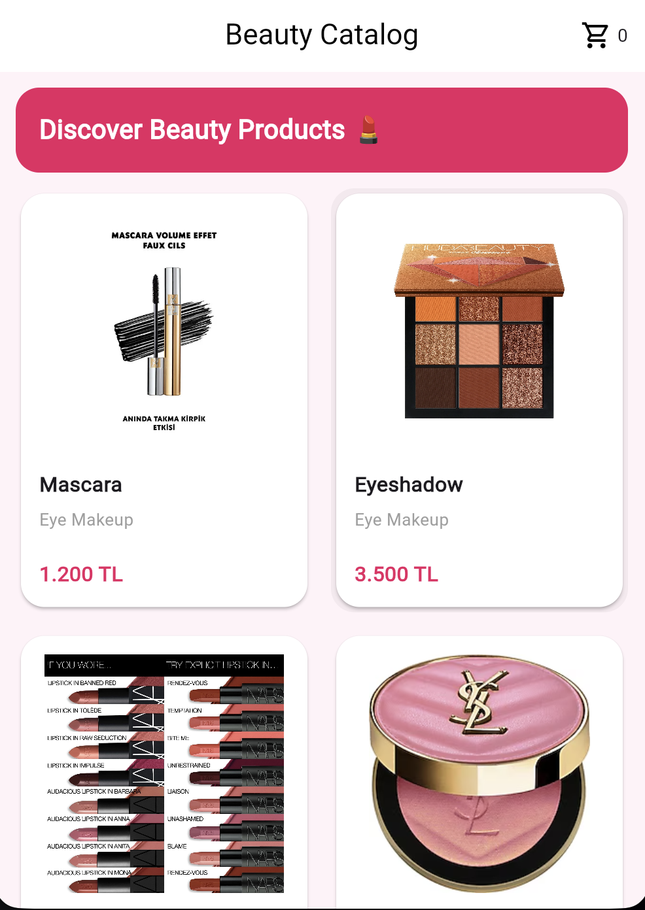
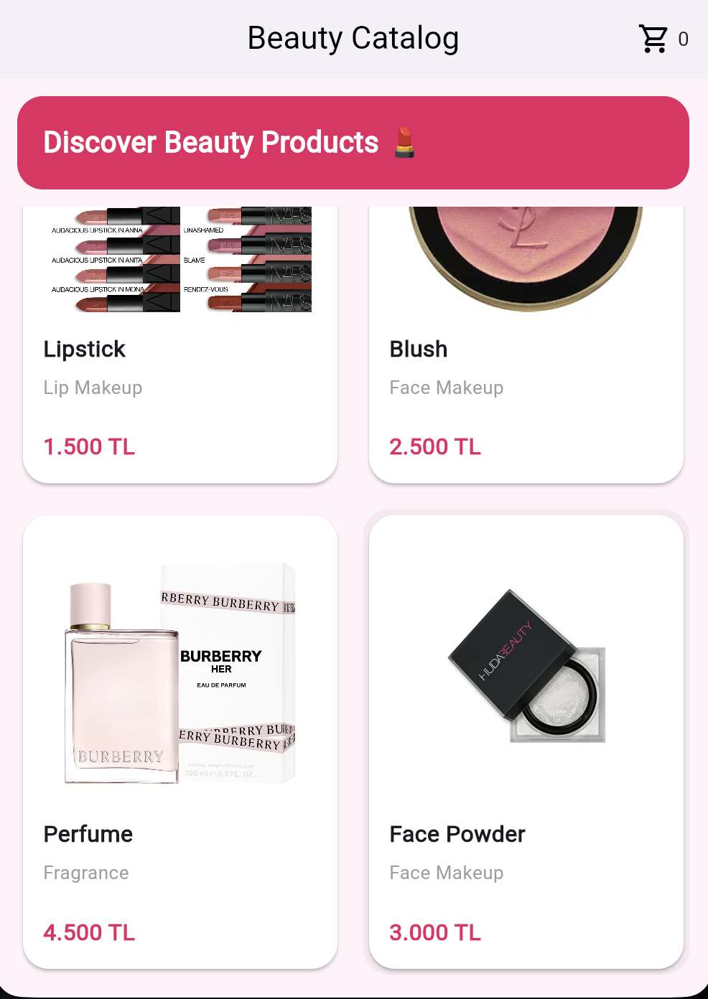
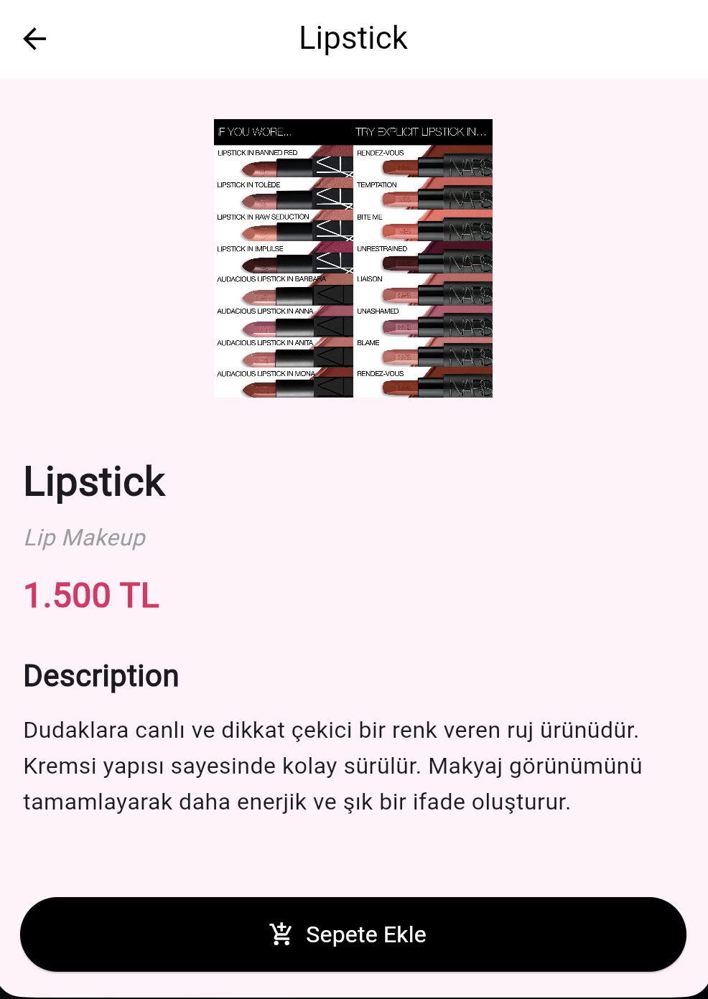
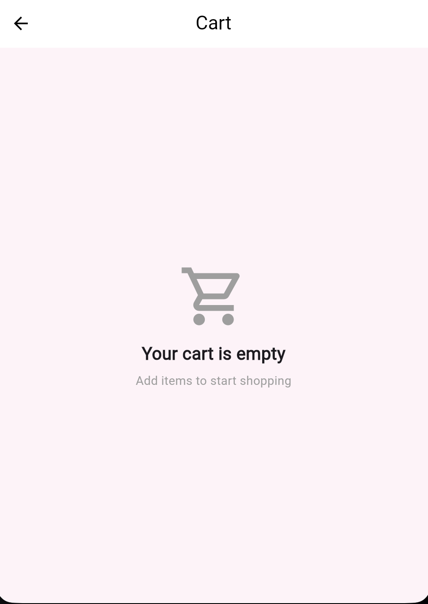
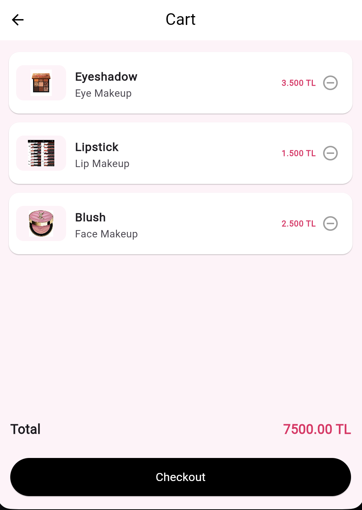

# 💄 Beauty Catalog App

## 📱 Proje Açıklaması
Bu proje Flutter eğitimi kapsamında geliştirilen basit bir “Mini Katalog Uygulaması”dır.  
Kullanıcılar ürünleri listeleyebilir, detaylarını görüntüleyebilir ve sepete ekleyebilir.

---

## 🚀 Özellikler
- Ürün listeleme (GridView)
- Ürün detay sayfası
- Sepete ekleme / çıkarma
- Sepet toplam fiyat hesaplama
- Basit state yönetimi

---

## 🛠 Kullanılan Teknolojiler
- Flutter 3.41.7
- Dart 3.11.5

---

## ▶️ Çalıştırma Adımları

```bash
git clone https://github.com/yarenmrmr/mini_katalog_app.git
cd mini_katalog_app
flutter pub get
flutter run
```

---

## 📸 Uygulama Görselleri

<h3>Ana Sayfa</h3>
<p>
  
  
</p>

<h3>Ürün Detayı</h3>
<p>
  
</p>

<h3>Sepet</h3>
<p>
  
  
</p>
